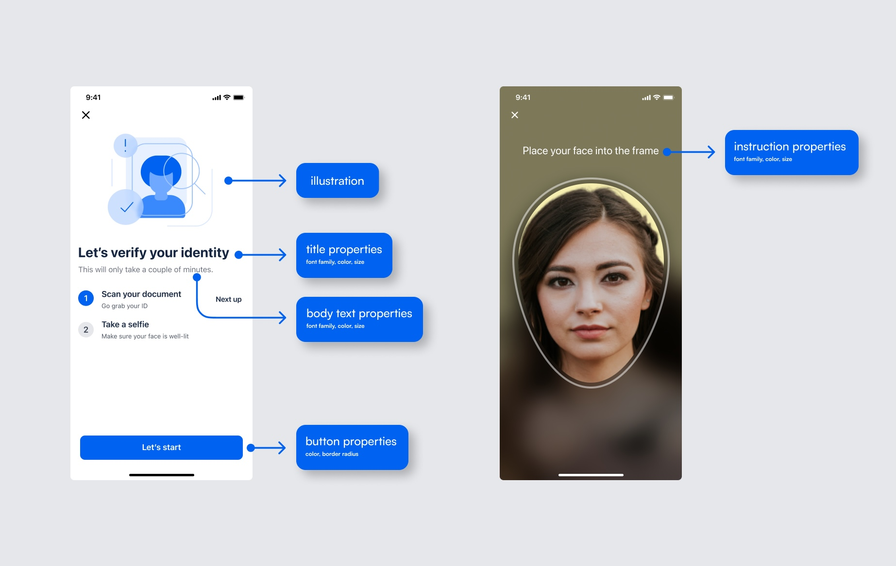
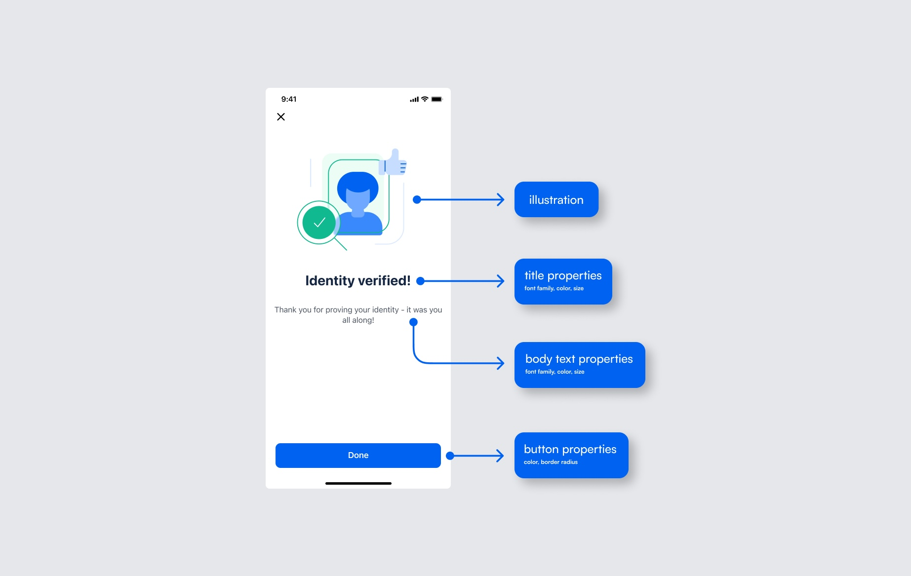
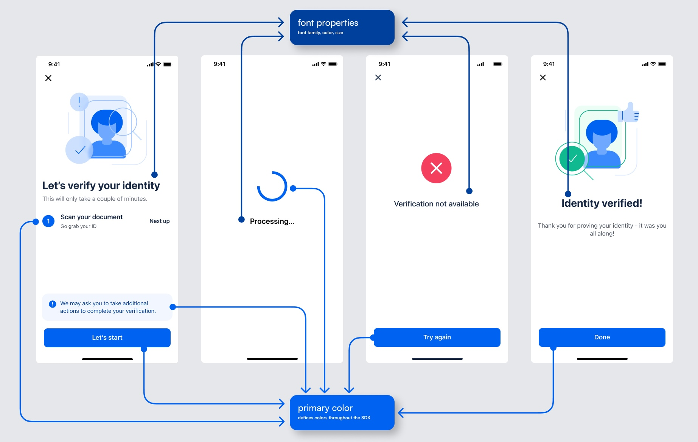
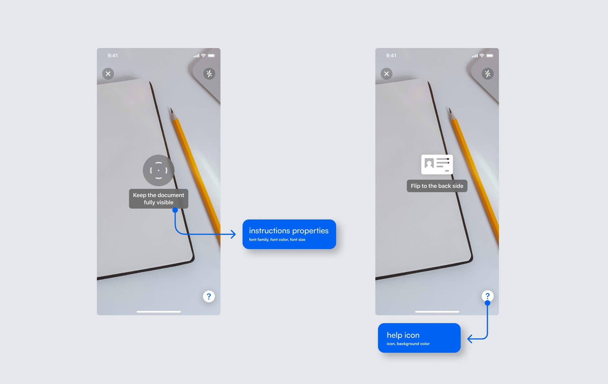
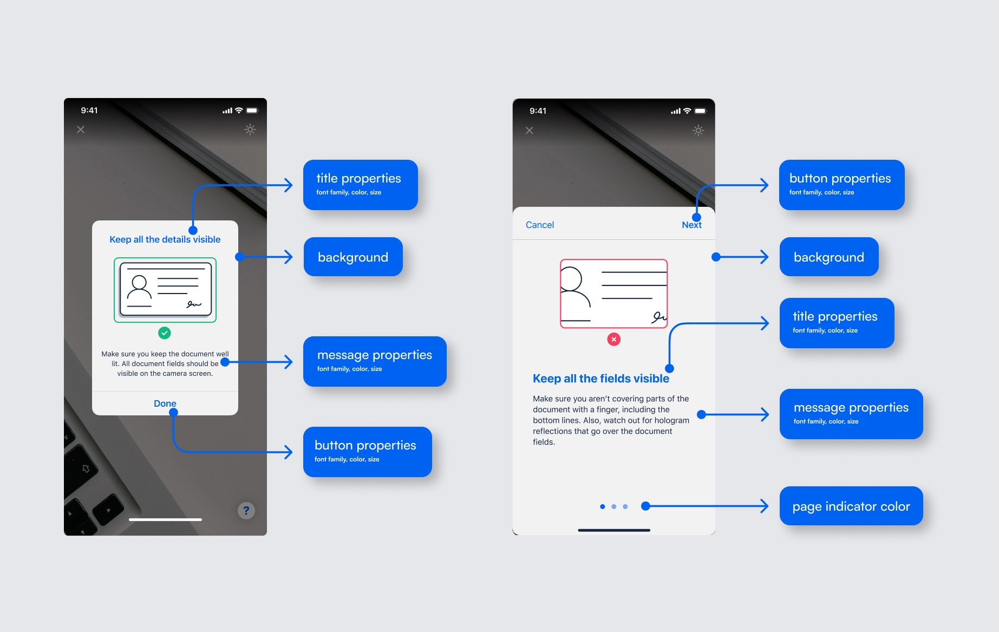

<p align="center">
  
</p>

[](https://img.shields.io/badge/Platform-iOS-blue)
[](https://img.shields.io/badge/Swift_Package_Manager-compatible-orange)

# MicroblinkPlatform SDK for iOS

Microblink Platform iOS SDK enables seamless and secure user authentication by integrating advanced identity verification features, such as document scanning, facial recognition, and real-time validation, into your application. It helps businesses ensure compliance, prevent fraud, and enhance user trust with minimal development effort.

## Table of Contents

  - [Requirements](#requirements)
  - [MicroblinkPlatform Server compatibility](#microblinkplatform-server-compatibility)
  - [SDK integration](#sdk-integration)
    - [Swift Package Manager](#swift-package-manager)
    - [Clone](#clone)
    - [UIKit](#uikit)
    - [SwiftUI](#swiftui)
  - [Sample apps](#sample-apps)
  - [Changing default strings](#changing-default-strings)
  - [Customizing the look](#customizing-the-look)

## Requirements

MicroblinkPlatform SDK requires iOS 16.0+.

## MicroblinkPlatform Server compatibility

In order to use the SDK, you need to define a proxy service which will be used to communicate with the Microblink Platform. This service should be used to forward requests from the SDK to the Microblink Platform and back in order to start the transaction. The service should be implemented on your side and SDK will use it to communicate with the platform.

> [!IMPORTANT]
> To use our API, you will need an `workflowId` and `authProviderHost`. [Please reach out to us to obtain these credentials](https://microblink.com/contact-us/).

Make sure that you use a compatible Workflow version for the MicroblinkPlatform iOS library version that you use.

## SDK integration

### Swift Package Manager

- File > Swift Packages > Add Package Dependency
- Add https://github.com/MicroblinkPlatform/microblink-platform-ios.git
- Select **Exact Version** - 1.1.0
- Add all dependencies to your target!

### Clone

If you prefer not to use Swift Package Manager, you can integrate MicroblinkPlatform into your project manually.

Manually import xcframeworks from `Frameworks` folder.

Additionally, clone [BlinkIDVerify repository](https://github.com/BlinkID/blinkid-verify-ios) to use `BlinkIDVerifyUX` and `BlinkIDVerify` xcframeworks.  

### UIKit

```swift
import MicroblinkPlatform
import UIKit

let consent = MicroblinkPlatformConsent(
    userId: user_id,
    isProcessingStoringAllowed: true,
    isTrainingAllowed: true,
    note: nil
)
        
let serviceSettings = MicroblinkPlatformServiceSettings(
    workflowId: your-workflow-id,
    authProviderHost: your_host_url,
    consent: consent,
    additionalRequestHeaders: nil
)
        
let microblinkPlatform = MicroblinkPlatformSDK(
    serviceSettings: serviceSettings,
    delegate: self
)
        
let viewController = microblinkPlatform.startSDK()

present(viewController, animated: true)
```

Verification results are returned via `MicroblinkPlatformSDKDelegate`.

```swift
func microblinkPlatformSDKDidFinish(viewController: UIViewController, result: MicroblinkPlatformResult) {
    // `MicroblinkPlatformResult` has:
    // - status enum that returns: accept, review, reject
    // - transactionId string
    viewController.dismiss(animated: true)
}
    
func microblinkPlatformSDKDidClose(viewController: UIViewController) {
    viewController.dismiss(animated: true)
}
```

### SwiftUI

```swift
import SwiftUI

struct ContentView: View {
    @State private var showSDK = false

    var body: some View {
        Button("Start SDK") {
            showSDK = true
        }
        .fullScreenCover(isPresented: $showSDK) {
            MicroblinkPlatformWrapperView(workflowId: your-workflow-id, authProviderHost: your_host_url, additionalRequestHeaders: nil) { microblinkPlatfromResult in
                showSDK = false
            } onClose: {
                showSDK = false
            }
        }
    }
}
```

Example of `MicroblinkPlatformWrapperView`.

```swift
import MicroblinkPlatform
import SwiftUI

struct MicroblinkPlatformWrapperView: UIViewControllerRepresentable {
    let workflowId: String
    let authProviderHost: String
    let additionalRequestHeaders: [String: String]?

    var onCompletion: (MicroblinkPlatformResult) -> Void
    var onClose: () -> Void

    init(workflowId: String, authProviderHost: String, additionalRequestHeaders: [String : String]? = nil, onCompletion: @escaping (MicroblinkPlatformResult) -> Void, onClose: @escaping () -> Void) {
        self.workflowId = workflowId
        self.authProviderHost = authProviderHost
        self.additionalRequestHeaders = additionalRequestHeaders
        self.onCompletion = onCompletion
        self.onClose = onClose
    }
    
    func makeUIViewController(context: Context) -> UIViewController {
        let consent = MicroblinkPlatformConsent(
            userId: user_id,
            isProcessingStoringAllowed: true,
            isTrainingAllowed: true,
            note: nil
        )
        
        let serviceSettings = MicroblinkPlatformServiceSettings(
            workflowId: workflowId,
            authProviderHost: authProviderHost,
            consent: consent,
            additionalRequestHeaders: additionalRequestHeaders
        )

        let microblinkPlatform = MicroblinkPlatformSDK(
            serviceSettings: serviceSettings,
            delegate: context.coordinator
        )

        return microblinkPlatform.startSDK()
    }

    func updateUIViewController(_ uiViewController: UIViewController, context: Context) {
    }

    func makeCoordinator() -> Coordinator {
        Coordinator(onCompletion: onCompletion, onClose: onClose)
    }

    // Verification results are returned via `MicroblinkPlatformSDKDelegate`.
    class Coordinator: NSObject, MicroblinkPlatformSDKDelegate {
        var onCompletion: (MicroblinkPlatformResult) -> Void
        var onClose: () -> Void

        init(onCompletion: @escaping (MicroblinkPlatformResult) -> Void, onClose: @escaping () -> Void) {
            self.onCompletion = onCompletion
            self.onClose = onClose
        }

        func microblinkPlatformSDKDidFinish(viewController: UIViewController, result: MicroblinkPlatformResult) {
            // `MicroblinkPlatformResult` has:
            // - status enum that returns: accept, review, reject
            // - transactionId string
            viewController.dismiss(animated: true) {
                self.onCompletion(result)
            }
        }

        func microblinkPlatformSDKDidClose(viewController: UIViewController) {
            viewController.dismiss(animated: true) {
                self.onClose()
            }
        }
    }
}
```

## Sample apps

Check our sample apps in `Samples` folder.

## Changing default strings

Copy `Localizable.xcstrings` file to your project from `Localization` folder.

Set bundle for `Localizable` file.

```swift
MicroblinkPlatformTheme.shared.localizationBundle = Bundle.main
```

## Customizing the look

It is not possible to move elements of the UI around, remove parts of the UI, or add new parts.

The MicroblinkPlatform SDK comes with the ability to customize some aspects of the UI by using the UI theming. The screens can be customized to fit your app’s look and feel by defining UI settings.

Customizations are done via `MicroblinkPlatformTheme`.

To change default blue tint, you can override primary color.

```swift
MicroblinkPlatformTheme.shared.primaryColor = your_color
```

To change image on main screen, you can override main screen image.

```swift
MicroblinkPlatformTheme.shared.mainScreenMainImage = your_image
```
To change font of title on main screen, you can override main screen title font.

```swift
MicroblinkPlatformTheme.shared.mainScreenTitleFont = your_font
```

To change button corner radius.

```swift
MicroblinkPlatformTheme.shared.buttonCornerRadius = your_corner_radius
```

<p align="center"></p>
<p align="center"></p>
<p align="center"></p>
<p align="center"></p>
<p align="center"></p>
<p align="center"></p>
